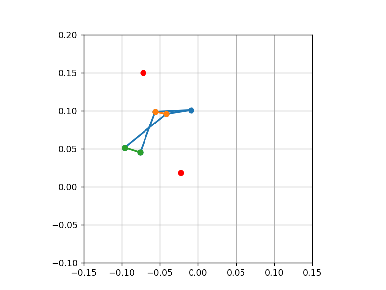

# Algoritmh for non Grashof four bar mechanism syntesis using differential evolution.

It is used to get machanism parameters based on the positions and orientations of the output link at predetermined points.
Applied for folding drone arm mechanism to find its geometrical parameters using geometrical restrictions.

## Links

* Non-Grashof Outward/Inward Limited Triple Rocker 
  https://www.softintegration.com/chhtml/toolkit/mechanism/fourbar/outward-inward.html
* Synthesis of four-bar linkage motion generation using optimization algorithms
  https://www.researchgate.net/publication/334899154_Synthesis_of_four-bar_linkage_motion_generation_using_optimization_algorithms
  
